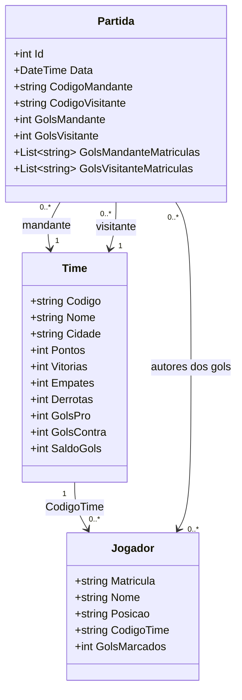

## GolPro — Sistema de Gerenciamento de Campeonatos de Futebol

--- 
# 1 - Visão Geral
O GolPro é um sistema de gerenciamento de campeonatos de futebol, permitindo cadastrar times, jogadores e partidas, além de gerar automaticamente a
tabela de classificação e o ranking de artilheiros.

--- 
# 2 - Objetivo
Prover um sistema console em C# para registro e acompanhamento de campeonatos
de futebol, automatizando o cálculo de pontuação, saldo de gols e artilharia.

--- 
# 3 - Escopo
O sistema abrange:
- Cadastro, alteração e exclusão de times, jogadores e partidas.
- Geração automática da tabela de classificação e relatório de artilheiros.

O sistema não abrange:
- Autenticação ou controle de acesso por usuário.
- Interface gráfica, opera exclusivamente via console.
- Integração com sistemas externos ou APIs.
- Gerenciamento de múltiplos campeonatos simultâneos.

--- 
# 4 - Regras de Negócio


RN01 - **Unicidade de Time:** Não é possível cadastrar dois times com o mesmo código. 
Garantido em: `TimeController.CRUD()` ao validar com `FindByCode()`.

RN02 - **Atribuição de Gols Exclusiva:** O gol de um jogador só pode ser registrado se o jogador pertencer ao time informado na partida. 
Garantido em: `PartidaController.RegistrarGolsJogadores()`.

RN03 - **Estorno de Estatísticas na Exclusão/Alteração:** Se uma partida for alterada ou excluída, os gols, pontos e saldo dos times, bem como os gols dos jogadores, devem ser estornados antes de aplicar o novo resultado. 
Garantido em: `PartidaController.CRUD()` e `PartidaController.EstornarGolsJogadores()`.

RN04 - **Pontuação da Partida:** A vitória vale 3 pontos, o empate 1 ponto e a derrota 0 pontos. 
Garantido em: `TimeModel.RegistrarPartida()` e `TimeModel.EstornarResultado()`.

RN05 - **Artilharia Mínima:** Apenas jogadores que marcaram pelo menos 1 gol (GolsMarcados > 0) podem aparecer no relatório de artilharia. 
Garantido em: `PartidaController.ReportArtilheiros()`.

--- 
# 5 - Requisitos Funcionais

RF01 - O sistema deve permitir o cadastro de times, incluindo código, nome e cidade. 
Garantido em: `TimeController.CRUD()`

RF02 - O sistema deve permitir o cadastro de jogadores, incluindo matrícula, nome, posição e vínculo ao time.
Garantido em: `JogadorController.CRUD()`

RF03 - O sistema deve permitir o registro de partidas, incluindo os times participantes, data e placar final.
Garantido em: `PartidaController.CRUD()`

RF04 - O sistema deve atualizar o contador de gols de cada jogador ao registrar uma partida.
Garantido em: `JogadorModel.AdicionarGols()` e `PartidaController.RegistrarGolsJogadores()`

RF05 - O sistema deve gerar um relatório da tabela de classificação ordenada por pontos e saldo de gols.
Garantido em: `PartidaController.Relatorio()`

RF06 - O sistema deve gerar um relatório de artilheiros do campeonato.
Garantido em: `PartidaController.ReportArtilheiros()`

--- 

# 6 -  Caso e uso 
UC01 - Cadastrar time
Ator : Usuaria do sistema
Pre-condição : Sistema em execução
Fluxo principal : 1 Usuario acessa " Cadastrar Time" 2 Usuario preenche os campos "Código", "Nome" e "Cidade" 3 Usuario clica em "Salvar"
FLuxo Alternativo : 3a Codigo já existe, o sistema exibe mensagem de erro "Código já cadastrado", oferece opção de 
"Voltar" para corrigir o código ou "Cancelar" para desistir do cadastro
Pós-condição : Time cadastrado com sucesso ou cadastro cancelado
Localização: TimeController.CRUD();

UC02 - Registrar partida
Ator: Usuaria do sistema
Pre-condição: PeloMenos 2 times cadastrados, sistema em execução
Fluxo Principal: 1. Usuário acessa 'Registro de Partidas' 2. Pressiona ENTER (nova partida) 3. Informa mandante, visitante, data e placar 4. Sistema valida (times existem, não são iguais) 5. Sistema pergunta gols por jogador 6. Estatísticas dos times e jogadores são atualizadas 7. Partida é salva
Fluxo Alternativo: 3a. Time não encontrado → mensagem de erro e nova entrada 3b. Times iguais → mensagem de erro e nova entrada
Pós condição: Partida registrada com sucesso, estatísticas atualizadas
Localização: PartidaController.CRUD();

UC03 — Gerar Tabela de Classificação
Ator: Usuária do sistema
Pre-condição: Pelo menos 1 Time cadastrado, sistema em execução
Fluxo Principal: 1. Usuário acessa 'Tabela de Classificação' 2. Sistema ordena times por pontos, saldo de gols e gols pró 3. Sistema exibe tabela formatada com moldura
Pós-codição: Tabela de classificação exibida corretamente
Localização: PartidaController.Relatorio();


UC04 - Gerar Relatório de Artilheiros

Ator: Usuária do sistema
Pre-condição: Pelo menos 1 gol registrado, sistema em execução
Fluxo Principal: Usuário acessa 'Artilheiros do Campeonato' 2. Sistema filtra jogadores com gols > 0 3. Sistema ordena por gols (desc) 4. Sistema exibe ranking formatado com moldura
Fluxo Alternativo: 2a. Nenhum gol registrado → mensagem informativa "Nenhum gol registrado ainda"
Pós-condição: Relatório de artilheiros exibido ou mensagem informativa
Localização: PartidaController.ReportArtilheiros()

--- 
# 7 - Diagrama de Classes 



--- 

# 8 - Mocks da Tela (Plain Text)

**Menu Principal**
```text                                             
  ╔════════════════════════════════════════════════════════════════════════════╗                                                                    
  ║                       GOLPRO - SISTEMA DE REGISTRO                         ║                                                                    
  ╠════════════════════════════════════════════════════════════════════════════╣                                                                    
  ║                                                                            ║                                                                    
  ║                                                                            ║                                                                    
  ║                                                                            ║                                                                    
  ║                                                                            ║                                                                    
  ║                    ┌────────────────────↑↓ 0-9 Enter─┐                     ║                                                                    
  ║                    │ ► 1 - Cadastros de Times        │                     ║                                                                    
  ║                    │   2 - Cadastros de Jogadores    │                     ║                                                                    
  ║                    │   3 - Registro de Partidas      │                     ║                                                                    
  ║                    │   4 - Tabela de Classificação   │                     ║                                                                    
  ║                    │   5 - Estatísticas de Jogadores │                     ║                                                                    
  ║                    │   0 - Sair                      │                     ║                                                                    
  ║                    │                                 │                     ║                                                                    
  ║                    └─────────────────────────────────┘                     ║                                                                    
  ║                                                                            ║                                                                    
  ║ Navegação:                                                                 ║                                                                    
  ║ ↑ ↓    Move a seleção                                                      ║                                                                    
  ║ ENTER  Confirma a opção                                                    ║                                                                    
  ║ ESC    Volta ao menu anterior                                              ║                                                                    
  ║                                                                            ║                                                                    
  ╚════════════════════════════════════════════════════════════════ GolPro v1.0     
```
**Cadastros de Times**
```text
  ╔════════════════════════════════════════════════════════════════════════════╗                                                                    
  ║                             CADASTRO DE TIMES                              ║                                                                    
  ╠════════════════════════════════════════════════════════════════════════════╣                                                                    
  ║ Código  :                                                                  ║                                                                    
  ║                                                                            ║                                                                    
  ║ Nome    :                                                                  ║                                                                    
  ║                                                                            ║                                                                    
  ║ Cidade  :                                                                  ║                                                                    
  ║                                                                            ║                                                                    
  ║                                                                            ║                                                                    
  ║                                          ┌─────↑↓ 0-9 Enter─┐              ║                                                                    
  ║                                          │ ► S - Sim (Sair) │              ║                                                                    
  ║                                          │   N - Não        │              ║                                                                    
  ║                                          │                  │              ║                                                                    
  ║                                          └──────────────────┘              ║                                                                    
  ║                                                                            ║                                                                    
  ║                                                                            ║                                                                    
  ║ Navegação:                                                                 ║                                                                    
  ║ ESC    Voltar ao menu anterior                                             ║                                                                    
  ║                                                                            ║                                                                    
  ║                                                                            ║                                                                    
  ║                                                                            ║                                                                    
  ╚════════════════════════════════════════════════════════════════ GolPro v1.0                                                                     
```
**Cadastros de Jogadores** 
```text
  ╔════════════════════════════════════════════════════════════════════════════╗                                                                    
  ║                           CADASTRO DE JOGADORES                            ║                                                                    
  ╠════════════════════════════════════════════════════════════════════════════╣                                                                    
  ║ Matrícula      :                                                           ║                                                                    
  ║                                                                            ║                                                                    
  ║ Nome           :                                                           ║                                                                    
  ║                                                                            ║                                                                    
  ║   Posicoes: Goleiro / Zagueiro / Lateral / Meia / Atacante                 ║                                                                    
  ║ Posicao        :                                                           ║                                                                    
  ║                                                                            ║                                                                    
  ║ Codigo do Time :                                                           ║                                                                    
  ║                                                                            ║                                                                    
  ║                                                                            ║                                                                    
  ║                                                                            ║                                                                    
  ║                                                                            ║                                                                    
  ║                                                                            ║                                                                    
  ║                                                                            ║                                                                    
  ║ Navegação:                                                                 ║                                                                    
  ║ ESC    Voltar ao menu anterior                                             ║                                                                    
  ║                                                                            ║                                                                    
  ║                                                                            ║                                                                    
  ║                                                                            ║                                                                    
  ╚════════════════════════════════════════════════════════════════ GolPro v1.0         
```                                                               

**Registro de Partidas** 

 ```text                                                         
  ╔════════════════════════════════════════════════════════════════════════════╗                                                                    
  ║                           REGISTRO DE PARTIDAS                             ║                                                                    
  ╠════════════════════════════════════════════════════════════════════════════╣                                                                    
  ║ ID              :                                                          ║                                                                    
  ║                                                                            ║                                                                    
  ║ Mandante        :                                                          ║                                                                    
  ║                                                                            ║                                                                    
  ║ Visitante       :                                                          ║                                                                    
  ║                                                                            ║                                                                    
  ║ Data (dd/MM/yyyy):                                                         ║                                                                    
  ║                                                                            ║                                                                    
  ║ Gols Mandante   :                                                          ║                                                                    
  ║                                                                            ║                                                                    
  ║ Gols Visitante  :                                                          ║                                                                    
  ║                                                                            ║                                                                    
  ║                                                                            ║                                                                    
  ║                                                                            ║                                                                    
  ║ Navegação:                                                                 ║                                                                    
  ║ ESC    Voltar ao menu anterior                                             ║                                                                    
  ║                                                                            ║                                                                    
  ║                                                                            ║                                                                    
  ║                                                                            ║                                                                    
  ╚════════════════════════════════════════════════════════════════ GolPro v1.0                                                                     
```                                                                                                                                                
                                                                              

**Tabela de Classificação**   
```text                                                                                                                                       
  ╔════════════════════════════════════════════════════════════════════════════╗                                                                    
  ║                          TABELA DE CLASSIFICAÇÃO                           ║                                                                    
  ╠════════════════════════════════════════════════════════════════════════════╣                                                                    
  ║ Cód  Nome                 Pts  V   E   D   GP  GC  SG                      ║                                                                    
  ║                                                                            ║                                                                    
  ║ PAL  Palmeiras             12   4   0   0  10   1   9                      ║                                                                    
  ║ FLA  Flamengo               7   2   1   1   5   4   1                      ║                                                                    
  ║ SAO  São Paulo              4   1   1   2   3   5  -2                      ║                                                                    
  ║ CAM  Atlético Mineiro       2   0   2   2   2   5  -3                      ║                                                                    
  ║ BOT  Botafogo               1   0   1   1   1   3  -2                      ║                                                                    
  ║ COR  Corinthians            1   0   1   1   1   3  -2                      ║                                                                    
  ║                                                                            ║                                                                    
  ║                                                                            ║                                                                    
  ║                                                                            ║                                                                    
  ║                                                                            ║                                                                    
  ║                                                                            ║                                                                    
  ║                                                                            ║                                                                    
  ║                                                                            ║                                                                    
  ║                                                                            ║                                                                    
  ║ Navegação:                                                                 ║                                                                    
  ║ ESC    Voltar ao menu anterior                                             ║                                                                    
  ║                                                                            ║                                                                    
  ╚════════════════════════════════════════════════════════════════ GolPro v1.0   
```
**Estatísticas de Jogadores** 

```text                                                                                                                                          
  ╔════════════════════════════════════════════════════════════════════════════╗                                                                    
  ║                         ARTILHEIROS DO CAMPEONATO                          ║                                                                    
  ╠════════════════════════════════════════════════════════════════════════════╣                                                                    
  ║ Matrícula  Nome                 Time  Gols                                 ║                                                                    
  ║                                                                            ║                                                                    
  ║ 2001       Endrick              PAL      5                                 ║                                                                    
  ║ 2002       Veiga                PAL      3                                 ║                                                                    
  ║ 1001       Pedro                FLA      3                                 ║                                                                    
  ║ 2003       Estêvão              PAL      2                                 ║                                                                    
  ║ 3001       Calleri              SAO      2                                 ║                                                                    
  ║ 1002       Arrascaeta           FLA      1                                 ║                                                                    
  ║ 1003       Luiz Araújo          FLA      1                                 ║                                                                    
  ║ 3002       Lucas Moura          SAO      1                                 ║                                                                    
  ║ 4001       Hulk                 CAM      1                                 ║                                                                    
  ║ 4002       Paulino              CAM      1                                 ║                                                                    
  ║ 5001       Junior Santos        BOT      1                                 ║                                                                    
  ║ 6001       Garro                COR      1                                 ║                                                                    
  ║                                                                            ║                                                                    
  ║                                                                            ║                                                                    
  ║ Navegação:                                                                 ║                                                                    
  ║ ESC    Voltar ao menu anterior                                             ║                                                                     
  ║                                                                            ║                                                                    
  ╚════════════════════════════════════════════════════════════════ GolPro v1.0
```

# 9 - Persistência em Arquivo Texto

Quando o programa encerra, os dados de times, jogadores e partidas são salvos em arquivos `.txt` dentro da pasta `Utils/Data/`. Na próxima execução, esses arquivos são lidos automaticamente antes de o menu aparecer — ou seja, nada se perde entre as sessões.

## Formato dos arquivos

O formato escolhido foi CSV simples, usando `;` como separador. Cada linha representa um objeto. Ficou assim:

**`times.txt`**
```
codigo;nome;cidade;pontos;vitorias;empates;derrotas;golsPro;golsContra
```
Exemplo:
```
PAL;Palmeiras;São Paulo;12;4;0;0;10;1
```

**`jogadores.txt`**
```
matricula;nome;posicao;codigoTime;golsMarcados
```
Exemplo:
```
2001;Endrick;Atacante;PAL;5
```

**`partidas.txt`**
```
id;codigoMandante;codigoVisitante;data;golsMandante;golsVisitante;matriculasMandante;matriculasVisitante
```
A data é gravada no formato `yyyyMMdd` (sem barras, para evitar conflito com o separador). As matrículas dos jogadores que marcaram gols são separadas por vírgula dentro do mesmo campo. Exemplo:
```
1;PAL;FLA;20240310;3;1;2001,2003;1001
```

## Como a leitura e escrita foram implementadas

A classe responsável é `Data`, no arquivo `Utils/Data.cs`. Ela recebe o caminho do arquivo no construtor e já cria o diretório caso ele não exista.

**Escrita** : Para cada entidade existe um método `Salvar*` (ex: `SalvarTimes`). Ele abre o arquivo com `StreamWriter` e chama o método `Serializar()` de cada objeto, que devolve a linha já formatada. A lógica de montar a linha fica no próprio Model, não espalhada pelo código.

**Leitura** : Para cada entidade existe um método `Carregar*` (ex: `CarregarTimes`). Ele abre o arquivo com `StreamReader`, lê linha por linha e faz `Split(';')` para separar os campos. Campos numéricos usam `int.TryParse()` em vez de conversão direta — assim, se uma linha estiver malformada por algum motivo, o programa usa 0 no lugar e continua sem quebrar. A data da partida usa `DateTime.TryParseExact()` com o formato `yyyyMMdd`.

 ## Decisões de Design

1. Organização do projeto em Controllers e Models

O projeto foi organizado em camadas, separando as classes em pastas como **Controllers** e **Models**. Essa estrutura foi adotada não apenas para atender aos requisitos do trabalho, mas também para facilitar a manutenção do código, melhorar sua organização e permitir maior facilidade de extensão futura. Com essa separação, as responsabilidades de cada classe ficam mais bem definidas, tornando o sistema mais fácil de entender, modificar e expandir no futuro.
 2. Persistência de dados em arquivos TXT

A persistência de dados foi implementada utilizando arquivos **TXT**, em vez de um banco de dados. Essa decisão foi tomada para reduzir a complexidade da aplicação e garantir que o sistema possa ser executado localmente sem depender da instalação ou configuração de um servidor de banco de dados. Além disso, para a dimensão e os requisitos do projeto, o armazenamento em arquivos atende adequadamente às necessidades da aplicação, mantendo sua simplicidade e portabilidade.

 


 # Dificuldades e Aprendizados

## Dificuldades

Durante o desenvolvimento do projeto, enfrentei algumas dificuldades que contribuíram para meu aprendizado.

A principal delas foi o gerenciamento do tempo, pois o desenvolvimento do projeto precisou ser conciliado com outras atividades do curso e compromissos pessoais.

Outro ponto foi a falta de engajamento nas aulas em alguns momentos, o que fez com que eu precisasse revisar conteúdos que já haviam sido apresentados pelo professor. Isso aumentou o tempo necessário para compreender alguns conceitos e implementá-los corretamente.

Também encontrei dificuldades na elaboração da documentação do projeto, principalmente para organizar as informações de forma clara e seguindo os requisitos propostos.

Na parte técnica, um dos maiores desafios foi compreender o funcionamento da aplicação como um todo, entendendo a responsabilidade de cada classe, método e função, além do fluxo de dados entre as camadas do sistema.

Por fim, a implementação da persistência de dados em arquivos foi outro desafio. Como esse assunto era novo para mim, foi necessário pesquisar conteúdos externos, consultar documentações e estudar exemplos para conseguir desenvolver essa funcionalidade.

## Aprendizados

Cada uma das dificuldades enfrentadas contribuiu diretamente para meu aprendizado, tanto no aspecto técnico quanto no desenvolvimento de habilidades comportamentais.

Além dos conhecimentos adquiridos durante o desenvolvimento do projeto, percebi a importância de manter um bom engajamento nas aulas, pois isso facilita o entendimento dos conteúdos e reduz o tempo necessário para estudar posteriormente.

Do ponto de vista técnico, o projeto proporcionou uma visão mais completa do ciclo de desenvolvimento de uma aplicação, desde o planejamento até a implementação e documentação.

Os principais aprendizados foram:

* Compreender melhor a estrutura de um projeto orientado a objetos.
* Separar responsabilidades e organizar o código em camadas (Models, Controllers e Utilitários).
* Implementar persistência de dados utilizando arquivos texto, sem a necessidade de um banco de dados.
* Trabalhar com manipulação de arquivos utilizando C#.
* Melhorar a organização do código, tornando-o mais legível e de fácil manutenção.
* Desenvolver maior autonomia para pesquisar documentações e buscar soluções para problemas encontrados durante o desenvolvimento.


## Referências

- **Projeto base:** Projeto "Biblioteca" desenvolvido pelo professor em aula, utilizado como referência de estrutura e organização.
- **Curso:** C# COMPLETO Programação Orientada a Objetos + Projetos | Nelio Alves. Disponível em: https://www.udemy.com/course/programacao-orientada-a-objetos-csharp/
- **Canal YouTube:** @baltaio https://www.youtube.com/@baltaio
- **Vídeo/Playlist:** https://www.youtube.com/watch?v=mIxvcB4XtJY&list=PLHlHvK2lnJnc4l_Iag26RMpUtV2Yl_X_j

 
╚════════════════════════════════════════════════════════════════ GolPro v1.0    
