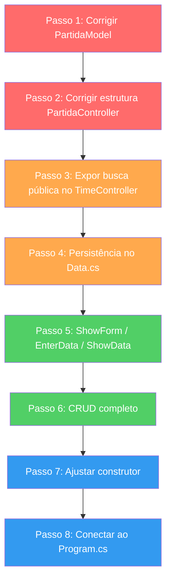

# 🗺️ Roteiro: Tornar a Funcionalidade de Partidas Funcional

## 📋 Diagnóstico do Estado Atual

Analisei os 3 arquivos + todo o projeto. Aqui está o que encontrei:

---
 
### 🔴 Erros e Problemas de Compilação Feito

#### [PartidaModel.cs](file:///e:/Projetos/C%23/GolPro/Model/PartidaModel.cs)

| # | Linha | Problema |
|---|-------|----------|
| 1 | L3 | **Namespace inconsistente** — usa `GolPro.Model` (singular), mas o controller importa `GolPro.Models` (plural na L3 do controller). Um dos dois precisa ser corrigido. |
| 2 | L49 | **Nome de propriedade inconsistente** — a propriedade se chama `GolVisitante` (singular), mas o campo backing é `_golsVisitante` (plural). Decida um padrão e unifique. |
| 3 | L87-93 | **Chave `{` extra** — o método `Serializar()` tem um bloco `{` desnecessário na L89 que causa erro de compilação. |
| 4 | L90 | **Separador errado** — `Serializar()` usa `|` como delimitador, mas **todos** os outros Models (Time, Jogador) usam `;`. Isso vai quebrar a leitura no `Data.cs`. |

#### [PartidaController.cs](file:///e:/Projetos/C%23/GolPro/Controller/PartidaController.cs)

| # | Linha | Problema |
|---|-------|----------|
| 5 | L3 | **Namespace errado** — importa `GolPro.Models` mas o model está em `GolPro.Model`. |
| 6 | L4 | **Namespace errado** — importa `GolPro.Utils` mas a classe Data está em `GolPro.utils` (minúsculo). |
| 7 | L34-35 | **Métodos inexistentes** — chama `_timeController.BuscarPorCodigo()` e `.RegistrarResultado()`. O `TimeController` não tem `BuscarPorCodigo` (tem `FindByCode`, que é **private**). O `TimeModel` tem `RegistrarPartida`, não `RegistrarResultado`. |
| 8 | L39-55 | **Métodos dentro do construtor** — os métodos `ObterTodos()`, `ObterProximoId()`, `DefinirLista()`, `FindById()` e `ShowForm()` estão aninhados **dentro do construtor** (abriram chave na L19 e nunca fecharam antes deles). Isso gera erro de compilação. |
| 9 | — | **Assinatura do construtor incompatível** — recebe `Tela`, `TimeController`, `JogadorController`, mas os outros controllers seguem o padrão `(col, row, width, height, tela, ...)`. A falta de coordenadas impede o uso da `Tela`. |

---

### 🟡 O que falta implementar

| # | Componente | O que falta |
|---|-----------|-------------|
| A | **Data.cs** | Não existe `SalvarPartidas()` nem `CarregarPartidas()` |
| B | **TimeController** | `FindByCode` é privado — precisa de um método público para o `PartidaController` buscar times |
| C | **PartidaController** | `ShowForm()` está vazio |
| D | **PartidaController** | Não tem `EnterData()` |
| E | **PartidaController** | Não tem `ShowData()` |
| F | **PartidaController** | Não tem `CRUD()` |
| G | **Program.cs** | Menu opção "3" ainda é placeholder ("Em breve") — precisa chamar o controller real |

---

## 🛤️ Roteiro Passo-a-Passo

### Passo 1 — Corrigir os erros de compilação do PartidaModel

**Arquivo:** [PartidaModel.cs](file:///e:/Projetos/C%23/GolPro/Model/PartidaModel.cs)

1. **Unificar o namespace** — O namespace deve ser `GolPro.Model` (como os outros models já usam).
2. **Corrigir o nome da propriedade** `GolVisitante` → `GolsVisitante` (para manter consistência com `GolsMandante`).
3. **Remover a chave `{` extra** dentro do método `Serializar()` (L89).
4. **Trocar o separador** do `Serializar()` de `|` para `;` — para seguir o mesmo padrão de `TimeModel.Serializar()` e `JogadorModel.Serializar()`.

> [!TIP]
> Teste: após essas correções, o `PartidaModel` deve compilar isoladamente sem erros.

---

### Passo 2 — Corrigir a estrutura do PartidaController

**Arquivo:** [PartidaController.cs](file:///e:/Projetos/C%23/GolPro/Controller/PartidaController.cs)

1. **Corrigir os `using`s** — `GolPro.Models` → `GolPro.Model`, `GolPro.Utils` → `GolPro.utils`.
2. **Fechar a chave do construtor** na linha correta (após o pré-carregamento, antes dos métodos).
3. **Mover os métodos** `ObterTodos()`, `ObterProximoId()`, `DefinirLista()`, `FindById()` e `ShowForm()` para **fora** do construtor, como membros da classe.
4. **Adicionar as coordenadas de tela** (`_column`, `_row`, `_width`, `_height`) ao controller, seguindo o padrão de `TimeController` e `JogadorController`.
5. **Corrigir as chamadas no pré-carregamento** — substituir `BuscarPorCodigo` e `RegistrarResultado` pelos nomes reais dos métodos (ou criar os públicos no passo seguinte).

> [!TIP]
> Teste: nesse ponto o PartidaController deve compilar (mesmo sem funcionalidades completas).

---

### Passo 3 — Expor busca pública no TimeController

**Arquivo:** [TimeController.cs](file:///e:/Projetos/C%23/GolPro/Controller/TimeController.cs)

O `PartidaController` precisa buscar times por código para validar se o mandante/visitante existem. Você tem duas opções:

- **Opção A** — Criar um método público `BuscarPorCodigo(string codigo)` no `TimeController` que retorna um `TimeModel` (basicamente expor a lógica do `FindByCode` já existente).
- **Opção B** — Tornar a propriedade `Times` acessível e fazer a busca diretamente no `PartidaController` (mas isso quebra o encapsulamento).

> [!IMPORTANT]
> Prefira a Opção A — mantém a responsabilidade de busca no `TimeController`.

---

### Passo 4 — Implementar persistência de Partidas no Data.cs

**Arquivo:** [Data.cs](file:///e:/Projetos/C%23/GolPro/Utils/Data.cs)

Seguindo o padrão exato dos métodos já existentes (`SalvarTimes`/`CarregarTimes` e `SalvarJogador`/`CarregarJogadores`):

1. **Criar `SalvarPartidas(List<PartidaModel> partidas)`** — percorrer a lista e chamar `partida.Serializar()` para cada uma, escrevendo em arquivo via `StreamWriter`.
2. **Criar `CarregarPartidas()`** — ler o arquivo linha por linha, fazer `Split(';')`, validar a quantidade de campos (6 campos: id, codMandante, codVisitante, data, golsMandante, golsVisitante), usar `TryParse` para os numéricos e `DateTime.TryParseExact` para a data, montar os objetos `PartidaModel` e retornar a lista.

> [!NOTE]
> O formato da linha serializada será: `id;codMandante;codVisitante;yyyyMMdd;golsMandante;golsVisitante`

---

### Passo 5 — Implementar ShowForm, EnterData, ShowData

**Arquivo:** [PartidaController.cs](file:///e:/Projetos/C%23/GolPro/Controller/PartidaController.cs)

Siga o padrão do [TimeController.cs](file:///e:/Projetos/C%23/GolPro/Controller/TimeController.cs#L51-L105):

1. **`ShowForm()`** — Chamar `_tela.PrepararTela("Registro de Partidas", ...)` e posicionar os labels dos campos:
   - `ID` (gerado automaticamente, exibir como read-only)
   - `Mandante (código)`
   - `Visitante (código)`
   - `Data (dd/MM/yyyy)`
   - `Gols Mandante`
   - `Gols Visitante`

2. **`EnterData("PK")`** — Ler o ID da partida (para buscar uma existente) ou, no caso de nova partida, gerar automaticamente via `_proximoId`.
3. **`EnterData("DT")`** — Ler os demais campos. Aqui incluir **validações**:
   - Os códigos de time devem existir (usar o `BuscarPorCodigo` do Passo 3)
   - Os dois times não podem ser iguais
   - Gols devem ser números ≥ 0
   - Data deve ser válida

4. **`ShowData()`** — Exibir os dados de `_current` nos campos do formulário (como TimeController faz).

---

### Passo 6 — Implementar o CRUD completo

**Arquivo:** [PartidaController.cs](file:///e:/Projetos/C%23/GolPro/Controller/PartidaController.cs)

Seguindo o fluxo do [UC02 do README](file:///e:/Projetos/C%23/GolPro/README.md#L42-L48):

```
CRUD()
├── ShowForm()
├── EnterData("PK")  →  lê ID
├── FindById(id)
│
├── SE encontrou:
│   ├── ShowData()
│   ├── Menu: [1-Alterar] [2-Excluir] [0-Voltar]
│   │
│   ├── Alterar:
│   │   ├── ShowForm() + ShowData()
│   │   ├── EnterData("DT")
│   │   ├── **Estornar** estatísticas antigas dos times (EstornarResultado)
│   │   ├── **Registrar** novas estatísticas nos times (RegistrarPartida)
│   │   ├── Salvar (_data.SalvarPartidas + _data.SalvarTimes)
│   │   └── MostrarMensagem("Partida alterada!")
│   │
│   └── Excluir:
│       ├── Confirmação S/N
│       ├── **Estornar** estatísticas dos times
│       ├── Remover da lista
│       ├── Salvar
│       └── MostrarMensagem("Partida excluída!")
│
└── SE não encontrou:
    ├── Menu: [1-Incluir] [0-Voltar]
    └── Incluir:
        ├── ShowForm()
        ├── EnterData("DT")
        ├── **Registrar** estatísticas nos times (RegistrarPartida)
        ├── Adicionar nova PartidaModel à lista
        ├── Salvar
        └── MostrarMensagem("Partida registrada!")
```

> [!IMPORTANT]
> **Detalhe crucial**: ao incluir/alterar/excluir uma partida, você precisa atualizar as estatísticas dos dois times envolvidos (`Pontos`, `Vitórias`, `Empates`, `Derrotas`, `GolsPro`, `GolsContra`). O `TimeModel` já tem os métodos `RegistrarPartida()` e `EstornarResultado()` prontos para isso. Após atualizar, salve os times também.

---

### Passo 7 — Ajustar o construtor do PartidaController

**Arquivo:** [PartidaController.cs](file:///e:/Projetos/C%23/GolPro/Controller/PartidaController.cs)

1. **Ajustar a assinatura** para receber `(int col, int row, int width, int height, Tela tela, TimeController timeCtrl, JogadorController jogCtrl)`.
2. **Instanciar o `Data`** apontando para `"Utils/Data/partidas.txt"`.
3. **Carregar do arquivo** via `_data.CarregarPartidas()` no construtor.
4. **Calcular o `_proximoId`** a partir da lista carregada (maior ID + 1), em vez de fixar em 1.
5. **Remover o pré-carregamento hardcoded** (a partida PAL×FLA) — isso vai vir do arquivo agora.

---

### Passo 8 — Conectar ao Program.cs

**Arquivo:** [Program.cs](file:///e:/Projetos/C%23/GolPro/Program.cs)

1. **Instanciar o `PartidaController`** após o `JogadorController`, passando as coordenadas, tela, e os controllers de Time e Jogador.
2. **Substituir o placeholder** da opção "3" (L53-58) por uma chamada ao `partidaController.CRUD()`.

---

## ✅ Lista de Verificação

Depois de implementar tudo, verifique:

- [ ] O projeto compila sem erros
- [ ] Criar uma partida nova grava em `Utils/Data/partidas.txt`
- [ ] Ao criar partida, as estatísticas dos times são atualizadas (verificar `times.txt`)
- [ ] Ao reabrir o programa, as partidas são carregadas do arquivo
- [ ] Alterar uma partida estorna as estatísticas antigas e aplica as novas
- [ ] Excluir uma partida estorna as estatísticas dos times
- [ ] Validações funcionam: time inexistente é rejeitado, times iguais são rejeitados
- [ ] O `_proximoId` é calculado corretamente a partir dos dados carregados

---

## 📌 Ordem de Dependência



> **🔴 Vermelho** = Correções de bugs (faça primeiro, senão nada compila)
> **🟠 Laranja** = Infraestrutura (preparar o terreno)
> **🟢 Verde** = Implementação da feature
> **🔵 Azul** = Integração final
